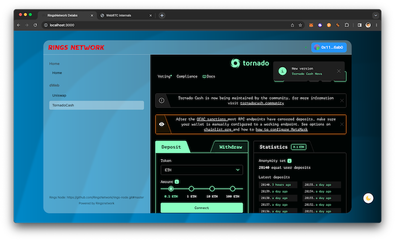
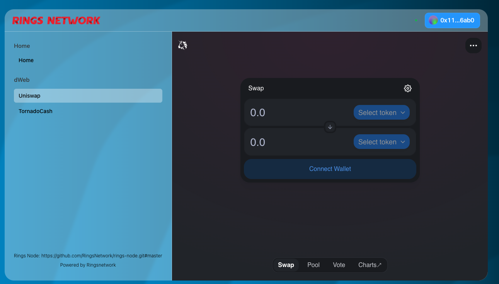
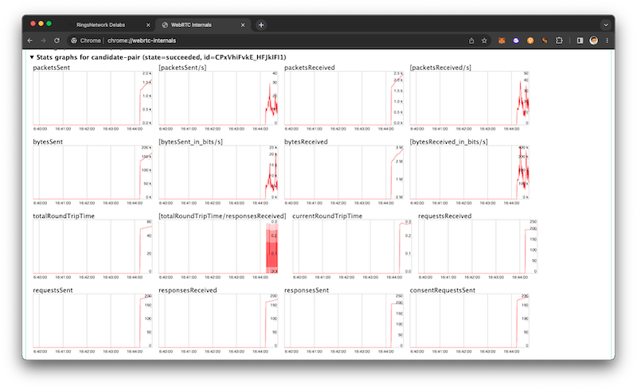

<picture>
  <source media="(prefers-color-scheme: dark)" srcset="https://static.ringsnetwork.io/ringsnetwork_logo.png">
  
</picture>


dWeb implementation power by Rings Network
====

# TL;DR

This is a dweb implementation based on Rings Network, which allows unrestricted access to network services and content. The process of accessing content is end-to-end encrypted. In this demo, we provide a simple decentralized access method for Uniswap and Tornado Cash.




# principles

In this demo, the principles Are as follows:

1. Load a wasm-based Rings Node within the browser and connect it to the network.

2. Rings Network utilizes the WebRTC protocol for data transmission and the Chord protocol for routing.

3. Requests specific resource information from other nodes, such as IPFS information for services like Uniswap or Tornado Cash.

4. Some network participants act as an IPFS provider service, responsible for fetching the requested content from the network and forwarding it to the requesting node.

For more details you can check our [Rings Whitepaper](https://raw.githubusercontent.com/RingsNetwork/whitepaper/master/rings.pdf).

# How network works

Our network is based on the WebRTC protocol, so you can observe how the network performs handshakes and communication by opening `chrome://webrtc-internals/` in Chrome or `about:webrtc` in Firefox. In essence, this process involves three steps: creating an Offer, exchanging the Offer to obtain an Answer from the remote peer, and accepting the Answer to establish the connection.



Rings Network supports direct exchange of SDP (Session Description Protocol) for establishing connections. In this example, we create the connection through the node entry point.

# How message and routing works

You can observe how our messages are encrypted, transmitted, and routed by examining our debug information. You can use the following commands in the console for debugging:

```text
localStorage.setItem("debug", true);
```


# Contribute and Build

1. Install

Prepare the Rust development environment to compile the latest Rings Node (recommended), or directly use our npm package `@RingsNetwork/rings-node`. If you choose to build with the Rust environment, the rings-node dependency in your package.json should be like this:

```text
    "@ringsnetwork/rings-node": "https://github.com/RingsNetwork/rings-node.git#master",
```

Alternatively, if you have already cloned Rings Node and want to compile it from your local repository:

```text
    "@ringsnetwork/rings-node": "git+file:<some path>#master",
```

Note: The git+file prefix is necessary because Rings Node's package.json relies on the prepare script to compile the Rust portion. Using a local path will bypass this script.

Then simply run:

```
make install
```

2. Setup Environments

You need to create an .env.local file to load the correct configurations, including the behavior during node initialization, STUN/TURN information, and more. The typical format of this file is as follows:

```text
NEXT_PUBLIC_WALLET_CONNECT_PROJECT_ID="<walletconnect id>"
NEXT_PUBLIC_TURN_URL="stun://stun.l.google.com:19302"
NEXT_PUBLIC_NODE_URL="<entry node url>"
NEXT_PUBLIC_SERVICE_NODE="<node provids services (optional)>"
```

3. Let's Go!!!

```
make dev
```
