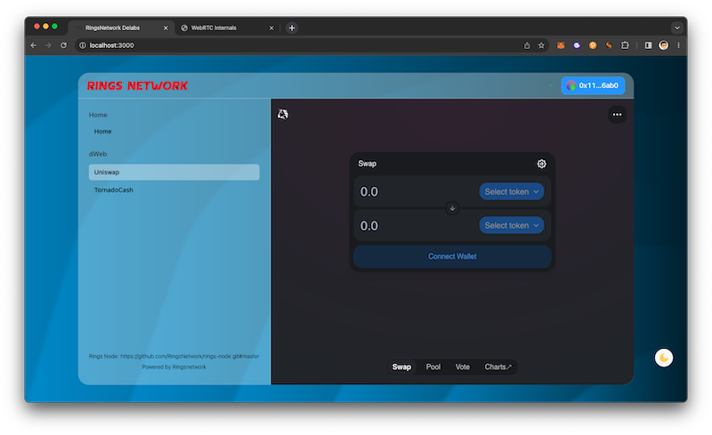

<picture>
  <source media="(prefers-color-scheme: dark)" srcset="https://static.ringsnetwork.io/ringsnetwork_logo.png">
  
</picture>


dWeb implementation power by Rings Network
====

# TL;DR

This is a dweb implementation based on Rings Network, which allows unrestricted access to network services and content. The process of accessing content is end-to-end encrypted. In this demo, we provide a simple decentralized access method for Uniswap and Tornado Cash.




# principles

In this demo, the principles Are as follows:

1. Load a wasm-based Rings Node within the browser and connect it to the network.

2. Rings Network utilizes the WebRTC protocol for data transmission and the Chord protocol for routing.

3. Requests specific resource information from other nodes, such as IPFS information for services like Uniswap or Tornado Cash.

4. Some network participants act as an IPFS provider service, responsible for fetching the requested content from the network and forwarding it to the requesting node.

For more details you can check our [Rings Whitepaper](https://raw.githubusercontent.com/RingsNetwork/whitepaper/master/rings.pdf).

# How network works

Our network is based on the WebRTC protocol, so you can observe how the network performs handshakes and communication by opening `chrome://webrtc-internals/` in Chrome or `about:webrtc` in Firefox. In essence, this process involves three steps: creating an Offer, exchanging the Offer to obtain an Answer from the remote peer, and accepting the Answer to establish the connection.


Rings Network supports direct exchange of SDP (Session Description Protocol) for establishing connections. In this example, we create the connection through the node entry point.

# How message and routing workS

You can observe how our messages are encrypted, transmitted, and routed by examining our debug information. You can use the following commands in the console for debugging:

```text
localStorage.setItem("debug", true);
```
